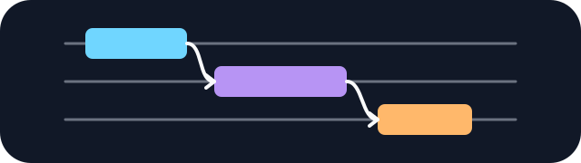

<div align="center">
  
  <h1>Build Your Trace</h1>
  <p>Learn distributed LLM training by rebuilding the traces it produces.</p>
</div>

Build Your Trace is a static set of interactive exercises about execution order, dependencies, and communication in modern LLM training. Start with a single-GPU forward/backward pass, then work through DDP, tensor parallelism, FSDP, expert parallelism, and context parallelism. The timelines use measured GPU runs where available and clearly marked analytical variants where hardware topology is modeled.

## Run locally

Node.js 20 or newer is enough; the site has no runtime packages to install.

```bash
npm run serve
```

Open [http://localhost:4173](http://localhost:4173). Use `PORT=8080 npm run serve` to choose another port.

## Check and build

```bash
npm run check
npm run check:release
npm run build:static
```

The static site is written to `dist/`. Serve that directory directly or copy it into a Hugo/PaperMod `static/` directory.

## Record the workloads

The scripts in `benchmarks/` run synthetic Qwen-shaped workloads with real PyTorch kernels and collectives. They do not download datasets or checkpoints. Start with:

```bash
python3 benchmarks/launch.py list
python3 benchmarks/launch.py validate
```

TorchTitan scenarios use the public `v0.2.0` tag. GPU package installation is intentionally left to an isolated environment because the correct PyTorch build depends on the host driver and CUDA runtime. See [`benchmarks/README.md`](benchmarks/README.md) for capture commands.

## Content

Tasks live in `data/` and are rendered by the shared engine in `src/app.js`. Add a task JSON file, register it in `data/tasks.json`, add its teaching notes, then run `npm run check`.
